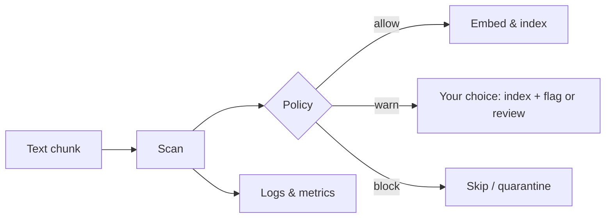

# ProtectRAG

**Screen RAG corpus text for prompt-injection**, apply allow / warn / block policies, and export **logs, metrics, and eval reports**—as a small Python library (no hosted service).

---

## Table of contents

1. [What it is](#what-it-is)
2. [How it works](#how-it-works)
3. [What it does not do](#what-it-does-not-do)
4. [Install](#install)
5. [Usage](#usage)
6. [Concepts & API](#concepts--api)
7. [Web apps & vector databases](#web-apps--vector-databases)
8. [Configuration (environment)](#configuration-environment)
9. [Observability & evals](#observability--evals)
10. [Limitations](#limitations)
11. [Development](#development)
12. [Publishing to PyPI](#publishing-to-pypi)
13. [License](#license)

---

## What it is

ProtectRAG helps you **check text before it is embedded and stored** in a retrieval (RAG) system. That text might contain **prompt injection**: hidden instructions meant to manipulate the assistant when the chunk is **retrieved** later.

You run it in your **ingestion pipeline** (batch indexer, API that accepts uploads, etc.) on each **document or chunk**, then only index what your policy allows.

---

## How it works

### High-level flow



1. **Scan** — Classify how risky the text is (heuristics and/or an LLM).
2. **Policy** — Map risk to **allow**, **allow with warning**, or **block** (thresholds you set).
3. **Side effects** — Optional structured **logs**, **metrics**, **run context**, and **offline evals**.

### Scanning modes

| Mode | Speed / cost | How |
|------|----------------|-----|
| **Heuristic** | Free, fast, local | Pattern rules (regex-style) for common injection phrases and markers. |
| **LLM** | API cost + latency | One small JSON classification call via OpenAI-compatible **Chat Completions**. |
| **Hybrid** | Usually best tradeoff | Heuristics first; **skips the LLM** when the text looks clean (configurable), with optional **caching** for identical text. |

Each scan returns a **`DocumentScanResult`**: severity (`NONE` → `HIGH`), score, which **detector** ran (`heuristic` / `llm` / `hybrid`), matched rules, optional **rationale** from the LLM.

### Ingest decisions

`ingest_document` applies thresholds:

| Decision | Typical meaning (defaults: warn ≥ `MEDIUM`, block ≥ `HIGH`) |
|----------|---------------------------------------------------------------|
| **ALLOW** | Below `warn_on` — treat as OK to index. |
| **ALLOW_WITH_WARNING** | At least `warn_on` but below `block_on` — index only if your app allows it; often logged for review. |
| **BLOCK** | At or above `block_on` — do not index (or send to quarantine). |

You can change `warn_on` and `block_on` via `InjectionSeverity`.

---

## What it does not do

- **Not a vector database client** — It does not call Pinecone, Qdrant, Weaviate, etc. You call ProtectRAG **before** your normal embed + upsert.
- **Not a full LLM firewall** — It focuses on **corpus-side** screening. You should still use **retrieval-time** and **generation-time** defenses in production.
- **Heuristics are imperfect** — Can miss subtle injections or rarely flag benign text. The **LLM** path is stronger but costs money and is still not 100% guaranteed.

---

## Install

**From PyPI** (after [you publish](#publishing-to-pypi)):

```bash
pip install protectrag
```

**From this repo** (editable dev install):

```bash
pip install -e ".[dev]"
```

**Extras:**

```bash
pip install "protectrag[llm]"   # httpx + LLM classifier
pip install "protectrag[otel]"  # OpenTelemetry tracing helpers
```

---

## Usage

### 1. Heuristics only (no API key)

```python
from protectrag import (
    IngestDecision,
    InjectionSeverity,
    ingest_document,
    scan_document_for_injection,
)

text = "..."  # chunk from your loader, API, or UI upload handler

r = scan_document_for_injection(text, document_id="chunk-001")
print(r.severity, r.should_alert, r.matched_rules)

out = ingest_document(
    text,
    document_id="chunk-001",
    block_on=InjectionSeverity.HIGH,
    warn_on=InjectionSeverity.MEDIUM,
)
if out.decision is IngestDecision.BLOCK:
    raise ValueError("do not index this chunk")
```

### 2. Hybrid (heuristics + LLM)

```python
import os
from protectrag import HybridScanner, LLMScanner, ingest_document, IngestDecision

os.environ["OPENAI_API_KEY"] = "..."  # or use .env + python-dotenv

with LLMScanner.from_env() as llm:
    hybrid = HybridScanner(llm)
    out = ingest_document(
        text,
        document_id="chunk-001",
        scan=lambda t, d: hybrid.scan(t, document_id=d),
    )
```

Reuse **one** `LLMScanner` instance across many chunks in the same process (connection reuse + optional LRU cache).

### 3. Logging

```python
from protectrag import configure_logging, ingest_document

configure_logging()
ingest_document(text, document_id="chunk-001")  # JSON lines to the logger
```

---

## Concepts & API

Main **exports** from `import protectrag`:

| Name | Role |
|------|------|
| `scan_document_for_injection` | Heuristic-only scan → `DocumentScanResult` |
| `ingest_document` | Scan + policy + optional logs/metrics/context |
| `LLMScanner`, `LLMScanConfig`, `scan_document_llm` | LLM classification |
| `HybridScanner`, `HybridPolicy` | Heuristic + LLM with skip rules |
| `InjectionSeverity`, `IngestDecision`, `IngestResult` | Enums and result types |
| `RunContext` | `run_id`, `project`, `environment`, dataset metadata for logs |
| `InMemoryMetrics`, `MetricsSink` | Counter/histogram hooks |
| `EvalCase`, `GroundTruth`, `run_eval_dataset`, `EvalReport` | Golden-set evaluation |
| `configure_logging`, `emit_ingest_event`, `trace_ingest_screen` | Logging / OTel |
| `span_attributes_for_ingest_scan` | Attributes for external trace exporters |

---

## Web apps & vector databases

- **UI / uploads:** Your backend receives the file or text from the browser, **extracts a string**, splits into **chunks**, then runs `ingest_document` (or `scan_*`) **per chunk** before embedding. ProtectRAG does not run in the browser; use **Python on the server** (or call a small API that uses this library).
- **Any vector DB:** Works with **all** stores (Pinecone, pgvector, Qdrant, …) because it only filters **text**; your app still does embed + upsert after a passing decision.

---

## Configuration (environment)

Optional variables for **LLM** mode (see [`.env.example`](.env.example)):

| Variable | Purpose |
|----------|---------|
| `OPENAI_API_KEY` | Required for LLM calls unless you pass `api_key` in `LLMScanConfig`. |
| `OPENAI_BASE_URL` | Default `https://api.openai.com/v1` (any OpenAI-compatible server). |
| `PROTECTRAG_LLM_MODEL` | Default `gpt-4o-mini`. |

Heuristic-only usage needs **none** of these.

---

## Observability & evals

- **Structured logs** — `emit_ingest_event` includes `document_id`, `severity`, `detector`, `rationale`, and optional **`RunContext`** fields (`run_id`, `project`, `environment`, …).
- **Metrics** — Pass an `InMemoryMetrics()` (or your own `MetricsSink`) to `ingest_document(..., metrics=...)` for counters such as `protectrag_ingest_total`.
- **OpenTelemetry** — With `[otel]`, `trace_ingest_screen` creates a span; use `span_attributes_for_ingest_scan` to align with OTLP / Phoenix-style backends.
- **Offline evals** — Build labeled `EvalCase` rows and `run_eval_dataset(...)` to get precision/recall-style **`EvalReport`** in CI.

Design-wise this mirrors ideas from **experiment runs + metrics** (e.g. Galileo-style) and **traces + golden sets** (e.g. Phoenix-style), but **without** a hosted dashboard—you plug logs/metrics into your own stack.

---

## Limitations

- Heuristic and LLM classifiers can both **err**; tune policies and combine with other controls.
- Long texts sent to the LLM are **truncated** (head + tail) per `LLMScanConfig.max_input_chars`.

---

## Development

```bash
pip install -e ".[dev]"
pytest tests/ -v
python -m build   # smoke-test sdist/wheel
```

---

## Publishing to PyPI

1. Ensure the **project name** in `pyproject.toml` is free on [PyPI](https://pypi.org/search/?q=protectrag).
2. `pip install build twine && python -m build`
3. `python -m twine upload dist/*` (use a [PyPI API token](https://pypi.org/manage/account/token/); try TestPyPI first if you want).
4. Bump **`version`** in `pyproject.toml` for each release.

Consumers can then depend on `protectrag>=…` instead of a Git URL.

---

## License

Apache 2.0 — see [`LICENSE`](LICENSE).
